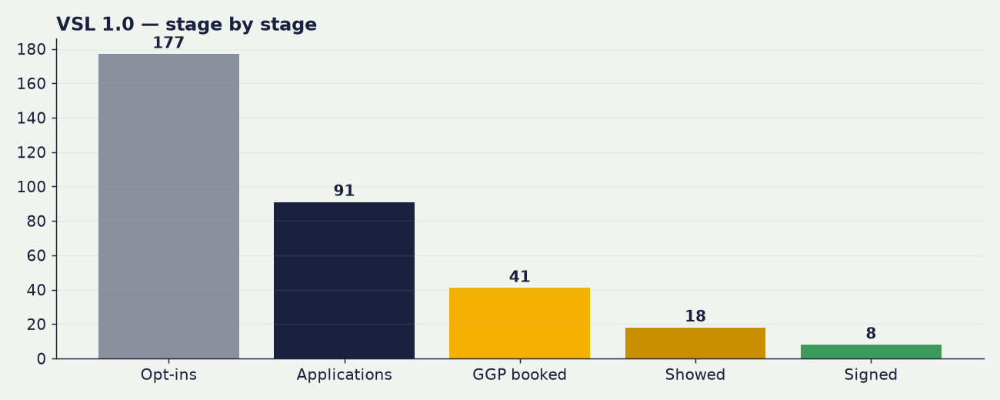
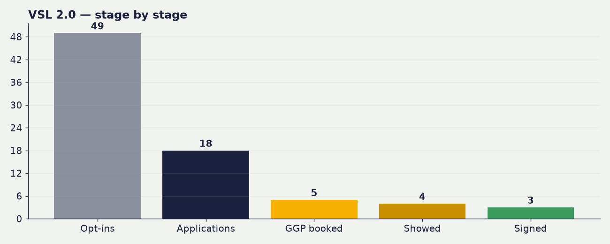

# 📈 VSL Funnel Dashboard

_Signups from Stripe (live API). Show-ups from the SBC team Tick Sheet. Spend from Meta. Updated 28 Aug 2026, 18:27 BST, rebuilds nightly._

## 🎯 The headline — both funnels combined

| | |
|---|---|
| **Blended CPA** | **£441** |
| Total spend | **£2,647.89** |
| Total signups | **6** |
| Who signed | Conor, Joe Gray-Misiuk, Kirstie Hall, Musa Rahat, Tarik Merrett, Zeeshan Ahmed |

> £2,648 spent → 6 signed = **£441 blended cost per signup.** VSL 1.0 (mass avatar) and VSL 2.0 (upgraded avatar) share the load: cheap high-volume + premium low-volume blend into one true acquisition cost.

---

## 🔀 VSL 1.0 vs 2.0 vs combined

| Metric | VSL 1.0 | VSL 2.0 | Combined |
|---|---|---|---|
| 🎯 **CPA** | **£490** | **£196** | **£441** |
| 🤝 Signed | 5 | 1 | **6** |
| 💷 Spent | £2,451.76 | £196.13 | **£2,647.89** |
| ✅ Showed up | 10 | 1 | **11** |
| 📞 GGPs booked | 18 | 1 | **19** |
| 📝 Applications | 50 | 3 | **53** |
| 👀 Opt-ins | 111 | 6 | **117** |

---

## VSL 1.0 — original avatar

> Auto-attribution: applicants matched to Calendly GGP bookings + attendance.

**Headline**

| Metric | Value |
|---|---|
| 💷 Spent | **£2,451.76** |
| 👀 Opt-ins | **111** |
| 📝 Applications | **50** |
| 📞 GGPs booked | **18** |
| ✅ Showed up | **10** |
| 🤝 Signed | **5** (Joe Gray-Misiuk, Kirstie Hall, Musa Rahat, Tarik Merrett, Zeeshan Ahmed) |

**Rates**

| Step | Rate |
|---|---|
| Opt-in → Application | 45% |
| Application → GGP booked | 36% |
| GGP show rate | 56% |
| Show → Sign | 50% |
| Application → Sign | 10% |

**Costs**

| Cost | Value |
|---|---|
| Cost per application | £49 |
| Cost per GGP booked | £136 |
| Cost per show-up | £245 |
| **Cost per acquisition (CPA)** | **£490** |

**Ad spend split**

- 🔥 Warm: £1,372.87
- ❄️ Cold: £1,078.89

---

## VSL 2.0 — upgraded avatar

> Self-contained: funnel-stage ticks on the Applications (VSL 2.0) tab, backed up by Calendly/Stripe.

**Headline**

| Metric | Value |
|---|---|
| 💷 Spent | **£196.13** |
| 👀 Opt-ins | **6** |
| 📝 Applications | **3** |
| 📞 GGPs booked | **1** |
| ✅ Showed up | **1** |
| 🤝 Signed | **1** (Conor) |

**Rates**

| Step | Rate |
|---|---|
| Opt-in → Application | 50% |
| Application → GGP booked | 33% |
| GGP show rate | 100% |
| Show → Sign | 100% |
| Application → Sign | 33% |

**Costs**

| Cost | Value |
|---|---|
| Cost per application | £65 |
| Cost per GGP booked | £196 |
| Cost per show-up | £196 |
| **Cost per acquisition (CPA)** | **£196** |

**Ad spend split**

- 🔥 Warm: £88.68
- ❄️ Cold: £107.45

---

## 📊 Trend charts (VSL 1.0)

### Daily applications & GGP bookings

### Cumulative growth

> _Applications + GGP-booked are TRUE daily series (from submission timestamps). Opt-ins have no per-day source in the Opt-ins tab, so opt-ins appear as a total only, not a daily line._

---
<!-- Auto-generated by the VSL dashboard nightly pipeline. Do not edit by hand. 28 Aug 2026, 18:27 BST -->
