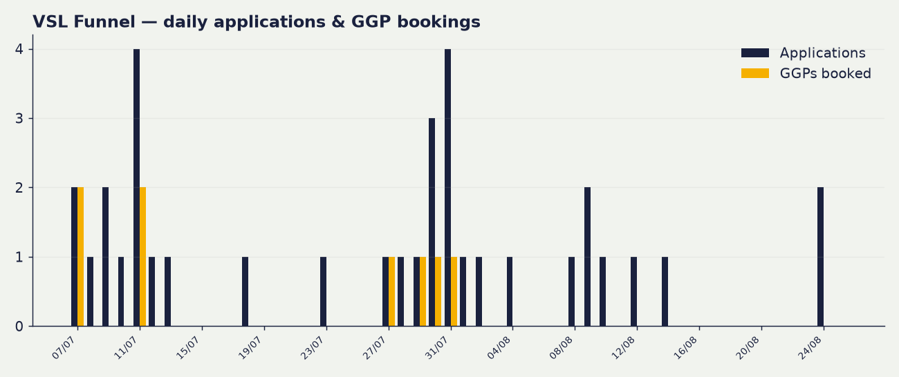
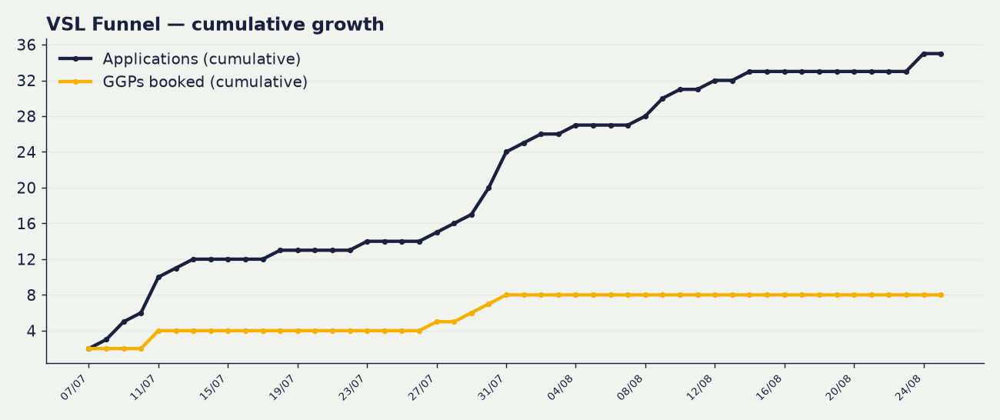

# 📈 VSL Funnel Dashboard

_Live from the VSL Applications tracker + Meta. Last updated: 25 Aug 2026, 04:01 BST. Rebuilds nightly._

> Funnel window from 2026-07-07. Attribution = your team's funnel-stage ticks on the Applications tab (the source of truth).

---

## The headline

| Metric | Value |
|---|---|
| 💷 Spent | **£2,217.05** |
| 👀 Opt-ins | **99** |
| 📝 Applications | **44** |
| 📞 GGPs booked | **13** |
| ✅ Showed up | **8** |
| 🤝 Signed | **2** (Tarik, Zeeshan) |

## The rates

| Step | Rate |
|---|---|
| Opt-in → Application | 44% |
| Application → GGP booked | 30% |
| GGP show rate | 62% |
| Show → Sign | 25% |
| Application → Sign | 5% |

## The costs

| Cost | Value |
|---|---|
| Cost per application | £50 |
| Cost per GGP booked | £171 |
| Cost per show-up | £277 |
| **Cost per acquisition (CPA)** | **£1,109** |

## Ad spend split

- 🔥 Warm: £1,196.59
- ❄️ Cold: £1,020.46

---

## Charts

### Funnel, stage by stage

### Daily applications & GGP bookings

### Cumulative growth

> _Applications + GGP-booked are TRUE daily series (from submission timestamps). Opt-ins have no per-day source in the Opt-ins tab, so opt-ins appear as a total only, not a daily line._

---
<!-- Auto-generated by the VSL dashboard nightly pipeline. Do not edit by hand. 25 Aug 2026, 04:01 BST -->
