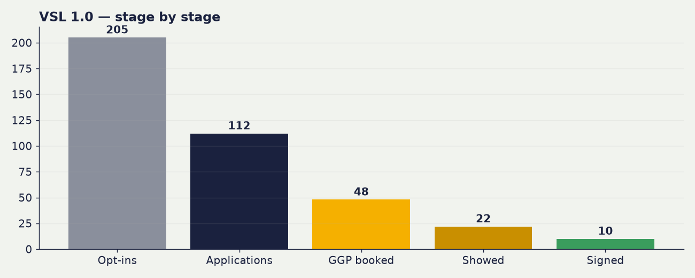
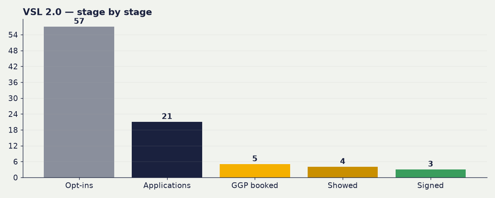
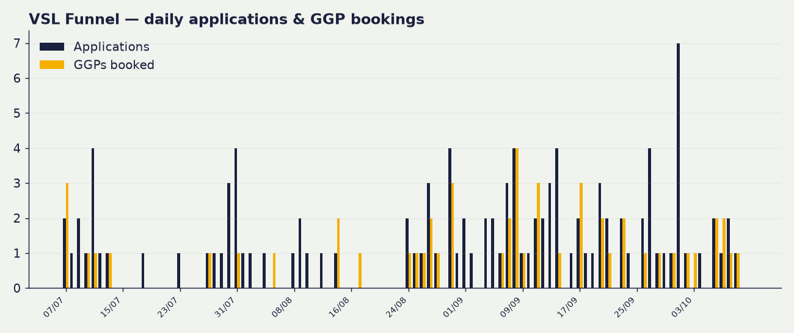
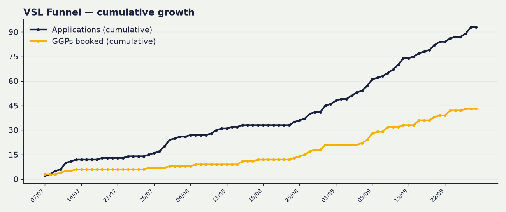

# 📈 VSL Funnel Dashboard

_Signups from Stripe (live API). Show-ups from the SBC team Tick Sheet. Spend from Meta. Updated 28 Sep 2026, 03:22 BST, rebuilds nightly._

## 🎯 The headline — both funnels combined

| | |
|---|---|
| **Blended CPA** | **£697** |
| Total spend | **£7,664.93** |
| Total signups | **11** |
| Who signed | Alexandru Mardari, C Beech, Conor, Daniel  Steer, Georgia, Harry, Joe Gray-Misiuk, Kirstie Hall, Musa Rahat, Tarik Merrett, Zeeshan Ahmed |

> £7,665 spent → 11 signed = **£697 blended cost per signup.** VSL 1.0 (mass avatar) and VSL 2.0 (upgraded avatar) share the load: cheap high-volume + premium low-volume blend into one true acquisition cost.

---

## 🔀 VSL 1.0 vs 2.0 vs combined

| Metric | VSL 1.0 | VSL 2.0 | Combined |
|---|---|---|---|
| 🎯 **CPA** | **£659** | **£798** | **£697** |
| 🤝 Signed | 8 | 3 | **11** |
| 💷 Spent | £5,269.52 | £2,395.41 | **£7,664.93** |
| ✅ Showed up | 20 | 4 | **24** |
| 📞 GGPs booked | 43 | 5 | **48** |
| 📝 Applications | 101 | 21 | **122** |
| 👀 Opt-ins | 191 | 57 | **248** |

---

## VSL 1.0 — original avatar

> Auto-attribution: applicants matched to Calendly GGP bookings + attendance.

> Split by lead region — **UK & Ireland** vs **US & Canada** (Ireland grouped with UK). Region from timezone + phone prefix; US&CA spend from the dedicated Meta campaigns.

**Headline**

| Metric | 🇬🇧🇮🇪 UK & Ireland | 🇺🇸🇨🇦 US & Canada | Total |
|---|---|---|---|
| 💷 Spent | £4,825.61 | £443.91 | **£5,269.52** |
| 👀 Opt-ins | 148 | 38 | **191** |
| 📝 Applications | 86 | 12 | **102** |
| 📞 GGPs booked | 36 | 7 | **44** |
| ✅ Showed up | 19* | 2 | **21*** |
| 🤝 Signed | 8 | 0 | **8** |

> \* Of those booked, **3** have a call date of today or later (3 UK&I) — not yet had a chance to show up. Show rate will firm up as those calls run.

**Rates**

| Step | 🇬🇧🇮🇪 UK & Ireland | 🇺🇸🇨🇦 US & Canada | Total |
|---|---|---|---|
| Opt-in → Application | 58% | 32% | **53%** |
| Application → GGP booked | 42% | 58% | **43%** |
| GGP show rate | 53% | 29% | **48%** |
| Show → Sign | 42% | 0% | **38%** |
| Application → Sign | 9% | 0% | **8%** |

**Costs**

| Cost | 🇬🇧🇮🇪 UK & Ireland | 🇺🇸🇨🇦 US & Canada | Total |
|---|---|---|---|
| Cost per application | £56 | £37 | **£52** |
| Cost per GGP booked | £134 | £63 | **£120** |
| Cost per show-up | £254 | £222 | **£251** |
| **Cost per acquisition (CPA)** | **£603** | **—** | **£659** |

**Ad spend split**

| Band | 🇬🇧🇮🇪 UK & Ireland | 🇺🇸🇨🇦 US & Canada | Total |
|---|---|---|---|
| 🔥 Warm | £2,940.83 | £222.02 | **£3,162.85** |
| ❄️ Cold | £1,884.78 | £221.89 | **£2,106.67** |

> 🤝 Signed — Alexandru Mardari, C Beech, Daniel  Steer, Joe Gray-Misiuk, Kirstie Hall, Musa Rahat, Tarik Merrett, Zeeshan Ahmed

> ⚠️ 5 opt-ins / 4 applications couldn't be region-tagged (no timezone + unusable phone) — included in Total, shown separately below.

---

## VSL 2.0 — upgraded avatar

> Self-contained: funnel-stage ticks on the Applications (VSL 2.0) tab, backed up by Calendly/Stripe.

**Headline**

| Metric | Value |
|---|---|
| 💷 Spent | **£2,395.41** |
| 👀 Opt-ins | **57** |
| 📝 Applications | **21** |
| 📞 GGPs booked | **5** |
| ✅ Showed up | **4** |
| 🤝 Signed | **3** (Conor, Georgia, Harry) |

**Rates**

| Step | Rate |
|---|---|
| Opt-in → Application | 37% |
| Application → GGP booked | 24% |
| GGP show rate | 80% |
| Show → Sign | 75% |
| Application → Sign | 14% |

**Costs**

| Cost | Value |
|---|---|
| Cost per application | £114 |
| Cost per GGP booked | £479 |
| Cost per show-up | £599 |
| **Cost per acquisition (CPA)** | **£798** |

**Ad spend split**

- 🔥 Warm: £1,554.92
- ❄️ Cold: £840.49

---

## 📊 Trend charts (VSL 1.0)

### Daily applications & GGP bookings

### Cumulative growth

> _Applications + GGP-booked are TRUE daily series (from submission timestamps). Opt-ins have no per-day source in the Opt-ins tab, so opt-ins appear as a total only, not a daily line._

---
<!-- Auto-generated by the VSL dashboard nightly pipeline. Do not edit by hand. 28 Sep 2026, 03:22 BST -->
