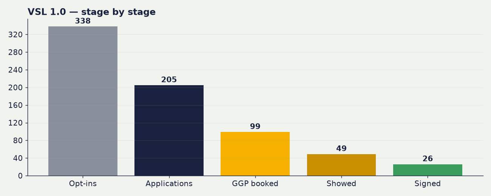

# 📈 VSL Funnel Dashboard

_Signups from Stripe (live API). Show-ups from the SBC team Tick Sheet. Spend from Meta. Updated 20 Nov 2026, 03:23 GMT, rebuilds nightly._

## 🎯 The headline — both funnels combined

| | |
|---|---|
| **Blended CPA** | **£646** |
| Total spend | **£17,432.04** |
| Total signups | **27** |
| Who signed | Adam Luke, Adam Timpson, Alex Mc Fadden, Alexandru Mardari, Benjamin Furuberg, C Beech, C-Jay Harvey, Conor, Daniel  Steer, Georgia, Harry, Hector McFadyen, Joe Gray-Misiuk, Kirstie Hall, Lily  Colmer, Lisa, MR B CAMPBELL, Matt, Mohit, Musa Rahat, Ray Miller, Ross gibbins, Stephen Webb, Tarik Merrett, Tom Wain, Zeeshan Ahmed, ross lachlan |

> £17,432 spent → 27 signed = **£646 blended cost per signup.** VSL 1.0 (mass avatar) and VSL 2.0 (upgraded avatar) share the load: cheap high-volume + premium low-volume blend into one true acquisition cost.

---

## 🔀 VSL 1.0 vs 2.0 vs combined

| Metric | VSL 1.0 | VSL 2.0 | Combined |
|---|---|---|---|
| 🎯 **CPA** | **£559** | **£950** | **£646** |
| 🤝 Signed | 21 | 6 | **27** |
| 💷 Spent | £11,734.44 | £5,697.60 | **£17,432.04** |
| ✅ Showed up | 40 | 12 | **52** |
| 📞 GGPs booked | 87 | 17 | **104** |
| 📝 Applications | 180 | 46 | **226** |
| 👀 Opt-ins | 312 | 123 | **435** |

---

## VSL 1.0 — original avatar

> Auto-attribution: applicants matched to Calendly GGP bookings + attendance.

> Split by lead region — **UK & Ireland** vs **US & Canada** (Ireland grouped with UK). Region from timezone + phone prefix; US&CA spend from the dedicated Meta campaigns.

**Headline**

| Metric | 🇬🇧🇮🇪 UK & Ireland | 🇺🇸🇨🇦 US & Canada | Total |
|---|---|---|---|
| 💷 Spent | £11,290.53 | £443.91 | **£11,734.44** |
| 👀 Opt-ins | 265 | 41 | **312** |
| 📝 Applications | 156 | 14 | **181** |
| 📞 GGPs booked | 73 | 9 | **88** |
| ✅ Showed up | 37* | 2* | **41*** |
| 🤝 Signed | 20 | 0 | **21** |

> \* Of those booked, **7** have a call date of today or later (5 UK&I, 2 US&CA) — not yet had a chance to show up. Show rate will firm up as those calls run.

**Rates**

| Step | 🇬🇧🇮🇪 UK & Ireland | 🇺🇸🇨🇦 US & Canada | Total |
|---|---|---|---|
| Opt-in → Application | 59% | 34% | **58%** |
| Application → GGP booked | 47% | 64% | **49%** |
| GGP show rate | 51% | 22% | **47%** |
| Show → Sign | 54% | 0% | **51%** |
| Application → Sign | 13% | 0% | **12%** |

**Costs**

| Cost | 🇬🇧🇮🇪 UK & Ireland | 🇺🇸🇨🇦 US & Canada | Total |
|---|---|---|---|
| Cost per application | £72 | £32 | **£65** |
| Cost per GGP booked | £155 | £49 | **£133** |
| Cost per show-up | £305 | £222 | **£286** |
| **Cost per acquisition (CPA)** | **£565** | **—** | **£559** |

**Ad spend split**

| Band | 🇬🇧🇮🇪 UK & Ireland | 🇺🇸🇨🇦 US & Canada | Total |
|---|---|---|---|
| 🔥 Warm | £7,181.90 | £222.02 | **£7,403.92** |
| ❄️ Cold | £4,108.63 | £221.89 | **£4,330.52** |

> 🤝 Signed — Adam Luke, Adam Timpson, Alex Mc Fadden, Alexandru Mardari, Benjamin Furuberg, C Beech, C-Jay Harvey, Daniel  Steer, Hector McFadyen, Joe Gray-Misiuk, Kirstie Hall, Lily  Colmer, MR B CAMPBELL, Musa Rahat, Ray Miller, Ross gibbins, Stephen Webb, Tarik Merrett, Tom Wain, Zeeshan Ahmed, ross lachlan

> ⚠️ 6 opt-ins / 11 applications couldn't be region-tagged (no timezone + unusable phone) — included in Total, shown separately below.

---

## VSL 2.0 — upgraded avatar

> Self-contained: funnel-stage ticks on the Applications (VSL 2.0) tab, backed up by Calendly/Stripe.

**Headline**

| Metric | Value |
|---|---|
| 💷 Spent | **£5,697.60** |
| 👀 Opt-ins | **123** |
| 📝 Applications | **46** |
| 📞 GGPs booked | **17** |
| ✅ Showed up | **12** |
| 🤝 Signed | **6** (Conor, Georgia, Harry, Lisa, Matt, Mohit) |

**Rates**

| Step | Rate |
|---|---|
| Opt-in → Application | 37% |
| Application → GGP booked | 37% |
| GGP show rate | 71% |
| Show → Sign | 50% |
| Application → Sign | 13% |

**Costs**

| Cost | Value |
|---|---|
| Cost per application | £124 |
| Cost per GGP booked | £335 |
| Cost per show-up | £475 |
| **Cost per acquisition (CPA)** | **£950** |

**Ad spend split**

- 🔥 Warm: £4,818.44
- ❄️ Cold: £879.16

---

## 📊 Trend charts (VSL 1.0)

### Daily applications & GGP bookings

### Cumulative growth

> _Applications + GGP-booked are TRUE daily series (from submission timestamps). Opt-ins have no per-day source in the Opt-ins tab, so opt-ins appear as a total only, not a daily line._

---
<!-- Auto-generated by the VSL dashboard nightly pipeline. Do not edit by hand. 20 Nov 2026, 03:23 GMT -->
